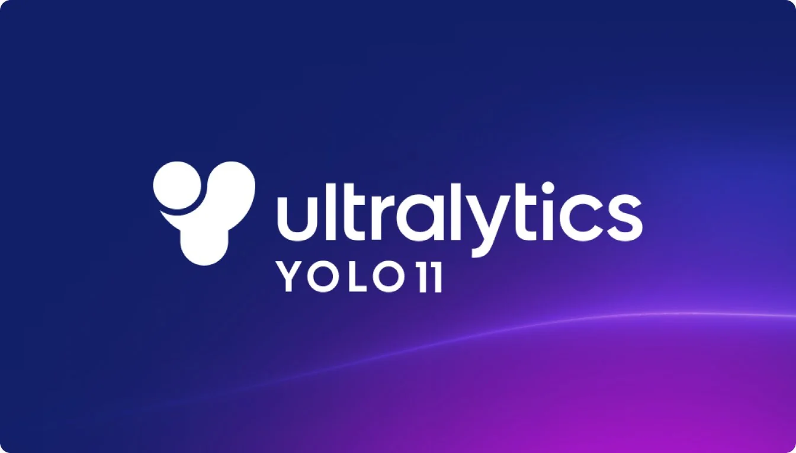
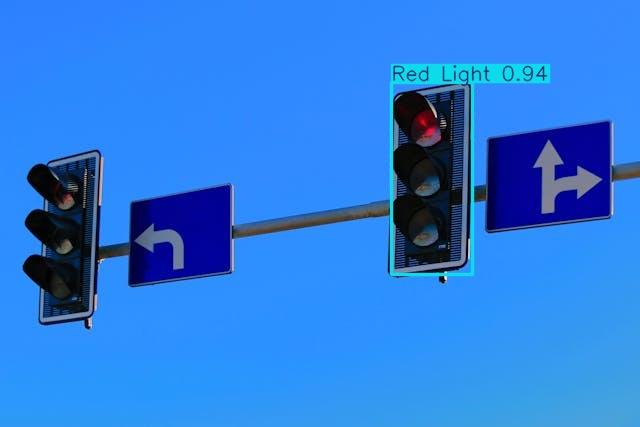
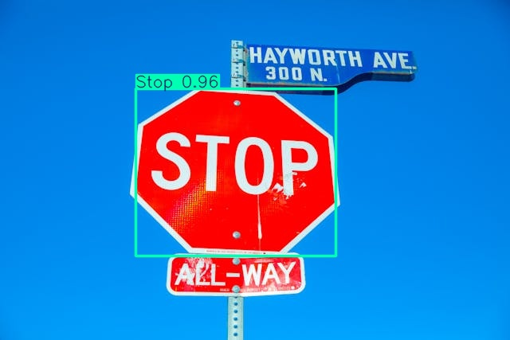
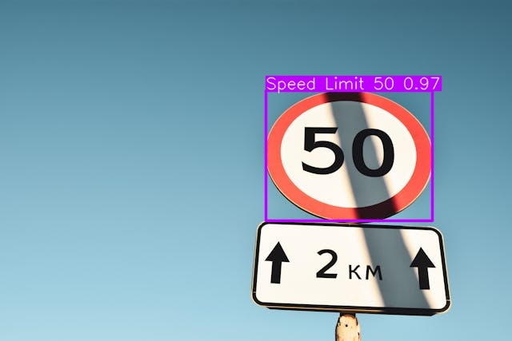
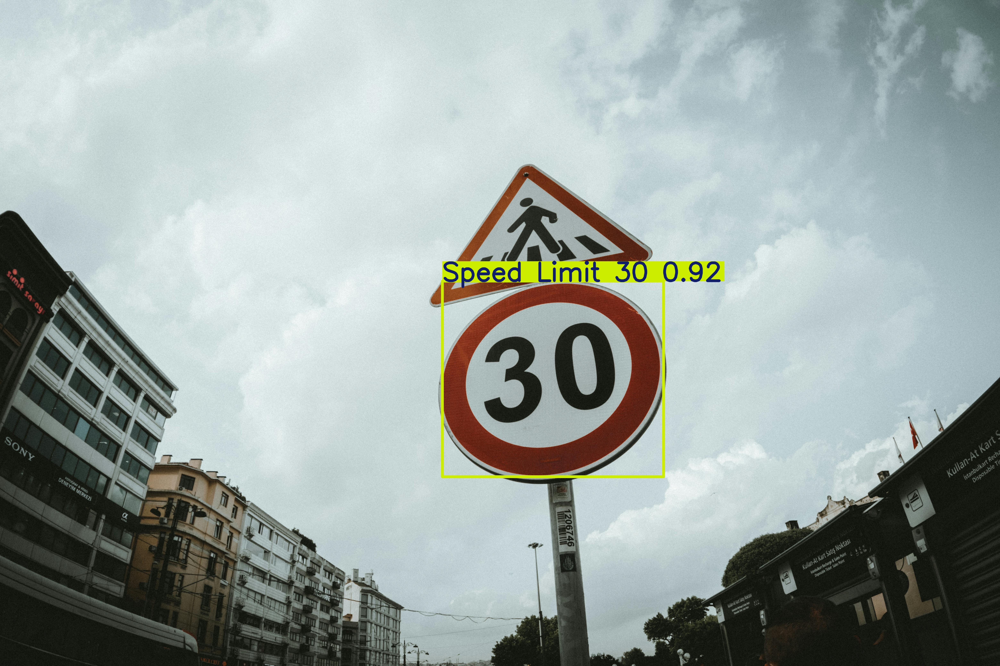

# Traffic Sign Detection using YOLOv11

- [Traffic Sign Detection using YOLOv11](#traffic-sign-detection-using-yolov11)
  - [Data](#data)
  - [Model](#model)
  - [Fine Tuning](#fine-tuning)
    - [YOLO11n summary (fused)](#yolo11n-summary-fused)
    - [Run summary](#run-summary)
  - [Detections](#detections)
  - [Dependencies](#dependencies)
  - [Project Setup](#project-setup)
  - [Limitations](#limitations)
  - [Conclusion](#conclusion)
  - [Acknowledgements](#acknowledgements)

## Data

The [Self-Driving Cars Dataset](https://universe.roboflow.com/selfdriving-car-qtywx/self-driving-cars-lfjou/dataset/6) is used to train the traffic sign detection model. It contains **4969** total images
split into train, val and test sets with **3530**, **801** and **638** images of dimension `416x416` respectively. The dataset contains images of 15 different traffic signs.

The classes available in the dataset are:

1. all
2. Green Light
3. Red Light
4. Speed Limit 100
5. Speed Limit 110
6. Speed Limit 120
7. Speed Limit 20
8. Speed Limit 30
9. Speed Limit 40
10. Speed Limit 50
11. Speed Limit 60
12. Speed Limit 70
13. Speed Limit 80
14. Speed Limit 90
15. Stop

## Model

The `yolo11n` version of the model is used to fine-tune on the dataset. The model was trained for **50** epochs with batch size **16**.

*Note*: The .ipy notebook is not uploaded due to privacy issues.

## Fine Tuning

### YOLO11n summary (fused)
238 layers, 2,585,077 parameters, 0 gradients, 6.3 GFLOPs

|   Class        |  Images | Instances |   Box(P  |    R    |  mAP50  | mAP50-95) |
|----------------|---------|-----------|----------|---------|---------|-----------|
|all             |  801    |    944    |   0.95   |  0.905  |  0.959  |   0.836   |
|Green Light     |   87    |    122    |   0.901  |  0.743  |  0.851  |   0.525   |
|Red Light       |   74    |    108    |   0.891  |  0.722  |  0.844  |   0.529   |
|Speed Limit 100 |   52    |     52    |   0.95   |  0.942  |  0.989  |   0.889   |
|Speed Limit 110 |   17    |     17    |   0.916  |      1  |  0.986  |   0.915   |
|Speed Limit 120 |   60    |     60    |       1  |  0.943  |  0.995  |   0.908   |
|Speed Limit 20  |   56    |     56    |   0.981  |   0.93  |  0.985  |   0.871   |
|Speed Limit 30  |   71    |     74    |   0.963  |  0.959  |  0.984  |   0.924   |
|Speed Limit 40  |   53    |     55    |   0.935  |  0.945  |  0.988  |   0.887   |
|Speed Limit 50  |   68    |     71    |   0.973  |  0.915  |   0.98  |   0.886   |
|Speed Limit 60  |   76    |     76    |    0.92  |  0.912  |   0.96  |    0.89   |
|Speed Limit 70  |   78    |     78    |   0.987  |  0.962  |  0.981  |     0.9   |
|Speed Limit 80  |   56    |     56    |    0.96  |  0.929  |  0.973  |   0.866   |
|Speed Limit 90  |   38    |     38    |   0.954  |  0.789  |  0.924  |   0.784   |
|Stop            |   81    |     81    |   0.975  |  0.982  |  0.988  |   0.929   |


### Run summary
|   Parameter / Metric  |  Value  |
|-----------------------|---------|
|lr/pg0                 |  2e-05  |
|lr/pg1                 |  2e-05  |
|lr/pg2                 |  2e-05  |
|metrics/mAP50(B)       | 0.95912 |
|metrics/mAP50-95(B)    | 0.83597 |
|metrics/precision(B)   | 0.95049 |
|metrics/recall(B)      | 0.90534 |
|model/GFLOPs           | 6.456   |
|model/parameters       | 2592765 |
|model/speed_PyTorch(ms)| 3.062   |
|train/box_loss         | 0.47508 |
|train/cls_loss         | 0.33472 |
|train/dfl_loss         | 0.90102 |
|val/box_loss           | 0.55826 |
|val/cls_loss           | 0.34385 |
|val/dfl_loss           | 0.95067 |

## Detections

<div style="display: flex; flex-direction: column; align-items: center;">
    <div>
        
        
    </div>
    <div>
        
        
    </div>
    <div>
        
        
    </div>
</div>


## Dependencies
- python 3.x
- opencv_contrib_python
- opencv_python
- ultralytics

## Project Setup

1. Make a virtual environment using the following command:

    ```bash
    python3 -m venv myenv
    ```

    Replace `myenv` with the name you want for your virtual environment. This will create a folder named myenv in your current directory containing the virtual environment files.

2. Activate the virtual environment:

    ```bash
    source myenv/bin/activate
    ```

    Remember to replace `myenv` with the actual name of the environment created in the previous step.

3. Clone the repository:

    ```bash
    git clone https://github.com/bhaskrr/traffic-sign-detection-using-yolov11.git
    ```

4. Navigate to the root directory of the project:

    ```bash
    cd path/to/the/project
    ```

5. Install dependencies:
    ```bash
    pip install -r requirements.txt
    ```

6. Run the scripts
   - To process images
        ```bash
        python3 process_image.py
        ```
    
    - To process videos
        ```bash
        python3 process_video.py
        ```

## Reproducible YOLO11 Baseline

The original repository contains inference media and a trained weight, but not the
training dataset or notebook. The scripts below create a versioned YOLO11 baseline
without changing the original inference code.

On Windows PowerShell, create the isolated legacy environment:

```powershell
.\scripts\setup_yolo11_baseline.ps1
```

The script requires a Python 3.9+ interpreter that can load the Windows root
certificate store. If `python` resolves to an unsuitable Conda environment, pass
the intended interpreter explicitly, for example:

```powershell
.\scripts\setup_yolo11_baseline.ps1 -PythonExecutable D:\python\python.exe
```

If PyTorch's download host needs to go through a conventional local proxy, pass
it explicitly. This only affects the setup process and does not change Windows
proxy settings:

```powershell
.\scripts\setup_yolo11_baseline.ps1 `
  -PythonExecutable D:\python\python.exe `
  -ProxyUrl http://127.0.0.1:7897
```

If your network closes TLS connections to those official hosts, retry with the
explicit, less secure fallback below. It bypasses certificate verification only
for PyPI and the official PyTorch host:

```powershell
.\scripts\setup_yolo11_baseline.ps1 -TrustOfficialHosts
```

This uses `ultralytics==8.3.5`, `torch==2.7.1` with CUDA 12.8, and a 416-pixel
input size. Download **Version 6** of the Self-Driving Cars dataset linked above,
export it in standard YOLO format, and extract it to
`datasets/self-driving-cars-v6/`. Keep the generated `data.yaml` unchanged so the
class order remains identical to the export.

Validate the data before evaluating it. The default validation expects 3530 train,
801 validation, 638 test images, and 15 classes:

```powershell
.\.venv-yolo11\Scripts\python.exe .\scripts\validate_dataset.py --data .\datasets\self-driving-cars-v6\data.yaml
```

Run the provided weight as the historical reference. Without `-DataYaml`, this
records the environment and creates annotated demo media only. With it, the script
also evaluates both `val` and `test` splits and stores every artifact under
`runs/baseline_yolo11/`:

```powershell
.\scripts\run_legacy_baseline.ps1 -DataYaml datasets/self-driving-cars-v6/data.yaml
```

Recreate the documented YOLO11n training conditions (50 epochs, batch 16,
416-pixel input, seed 42) and evaluate its `best.pt` on the test split:

```powershell
.\scripts\train_yolo11_baseline.ps1 -DataYaml datasets/self-driving-cars-v6/data.yaml
```

Finally, record headless video latency after 50 warm-up frames. The JSON report
contains mean/median/P95 latency, FPS, and peak GPU memory. It times decode,
prediction, and annotation but excludes model loading and output video encoding:

```powershell
.\.venv-yolo11\Scripts\python.exe .\scripts\benchmark_inference.py `
  --model .\model\traffic_sign_detector.pt `
  --source .\data\input\traffic_signs.mp4 `
  --output .\runs\baseline_yolo11\legacy_video_benchmark.json `
  --imgsz 416 --device 0
```

The original supplied checkpoint is a historical reference. For the eventual
YOLO26 comparison, train a new YOLO11n and YOLO26n in the same modern Ultralytics
environment using the same exported data, 416 input size, seed, batch size, and
test script.

To fine-tune the bundled traffic-sign checkpoint on the local
`self-driving-cars-v6` dataset, run:

```powershell
.\.venv-yolo11\Scripts\python.exe .\train_traffic_sign_model.py
```

The fine-tuning entry point uses a 640-pixel input by default to preserve more
detail for small traffic signs. The historical 416-pixel baseline commands
above remain unchanged for controlled comparison.

Add `--test-after-train` to evaluate the resulting `best.pt` on the test split.
## Limitations

The model tends to perform better with images and is fairly accurate with videos in certain scenarios. So, to obtain better results with videos or real-time data, consider fine-tuning a deeper model available on ultralytics docs.

## Conclusion

This project demonstrates how a fine-tuned YOLOv11 model can be used for traffic sign detection.

Here are a few use cases for this project:

1. Autonomous Vehicle Navigation: The model can be used in self-driving car systems to recognize traffic signs accurately. This would enable autonomous vehicles to follow traffic rules and regulations, analyzing every sign whether it’s about speed limit or stop-and-go indications to navigate the roads safely.

2. Traffic Rule Compliance: This model can be used in driver assistance systems to ensure that drivers comply with all traffic rules. Alerts can be generated when drivers exceed the speed limit or don't stop at red lights, fostering safer roads.

3. Road Safety Training Programs: This model allows Driving schools and automotive companies to build simulations and education programs. These programs can guide new drivers in identifying and responding to different traffic signs, thus enhancing road safety knowledge.

4. Smart City Infrastructure: City authorities could use this model in connected CCTV or IoT infrastructure to track and monitor traffic compliance in real time, helping identify areas with frequent rule violations for potential improvement.

5. Road Network Analysis: Transportation engineering researchers can use this model to analyze how efficiently different sign classes are distributed and recognized around the city. This data can be instrumental in planning more efficient and safer road networks.

## Acknowledgements

The media files used to test the model predictions are taken from [pexels.com](https://www.pexels.com/).
